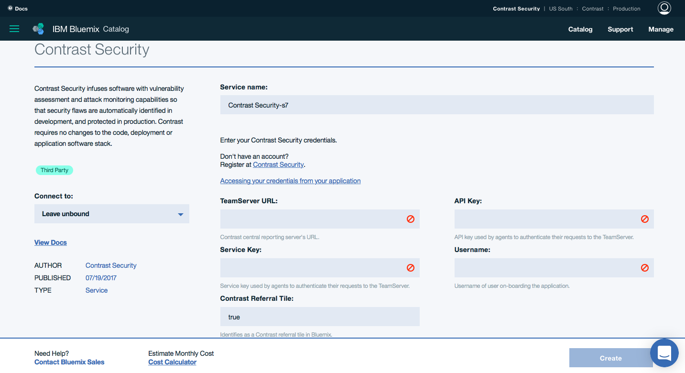

---
copyright:

  years:  2017

lastupdated: "2017-07-19"

---

{:new_window: target="_blank"}
{:shortdesc: .shortdesc}
{:screen:.screen}
{:codeblock:.codeblock}
{:pre: .pre}


# Getting started with Contrast Security
{: #gettingstarted_ContrastSecurity}


Use Contrast Security to detect security vulnerabilities in your application and protect them against attacks.
{:shortdesc}


Before an application developer can use the Contrast agent within an app, please visit our https://www.contrastsecurity.com/bluemix) to sign up for an account.

Complete these steps to get started with the Contrast Security service:


1. Step 1. You will need to provide four pieces of information to create a service plan.
	
 	* Contrast URL - The url you use to get to your Contrast dashboard (also known as TeamServer).  In most cases this will be https://app.contrastsecurity.com
 	* API Key - Can be found within TeamServer: Click your name then in the dropdown choose Organization Settings then select API
 	* Service Key - Can be found within Teamserver: Click your name, then in the dropdown choose Organization Settings, then select API
 	* Username - Email or Username used to log into TeamServer

2. Step 2. Once the Contrast service has been created, you can bind it to your application.
  	Replace contrast-security-service in the example below with the name you used for the service.
  	```
  	cf bind-service your_app_name contrast-security-service
  	```
  	{: screen}

3. Step 3. Now that the service has been bound to an application, the service plan will be shown in the applications VCAP_SERVICES environment variables.

 	```
 	"VCAP_SERVICES": {
  	"user-provided": [
    	{
      	"credentials": {
        	"api_key": "your_api_key",
        	"service_key": "your_service_key",
        	"teamserver_url": "https://app.contrastsecurity.com",
        	"username": "your_username_or_email",
                          	"contrast_referral_tile":"true"
      	},
      	"syslog_drain_url": "",
      	"volume_mounts": [],
      	"label": "user-provided",
      	"name": "contrast-security-service",
      	"tags": []
    	}
  	]
	}
 	```
 	{: screen}

4. Step 4 When the application is restaged, the Contrast Security Java Agent will be downloaded and configured to work with your application.
 	```
 	cf restage your_app_name
 	```
 	{: screen}


## Support
For more information or support issues, please reach out to us at support@contrastsecurity.com.</pre>
