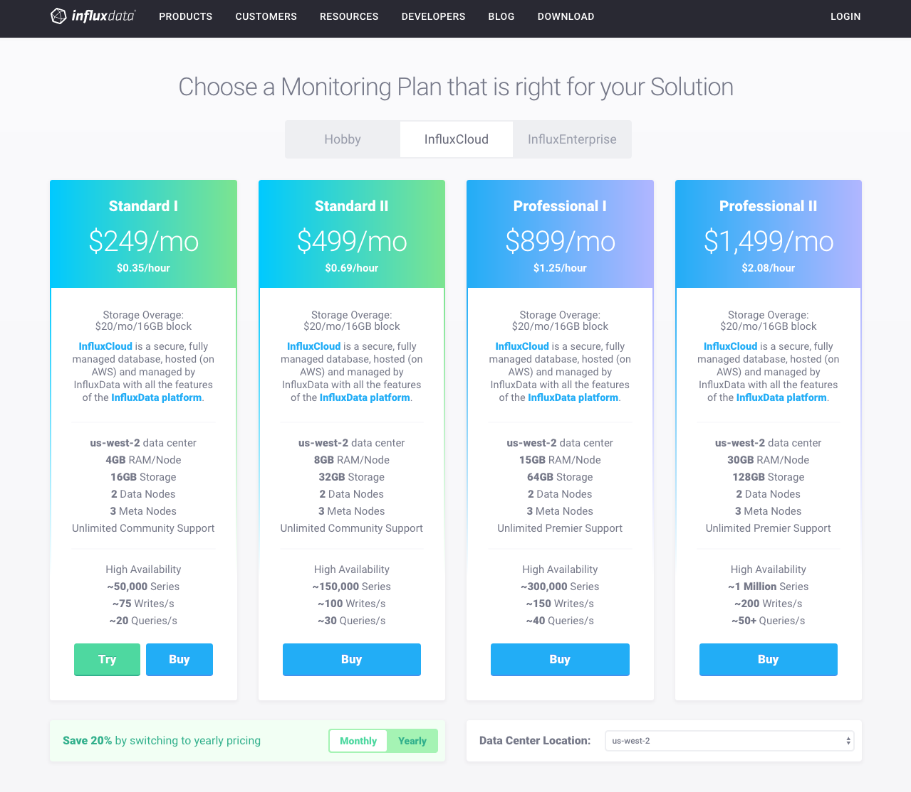
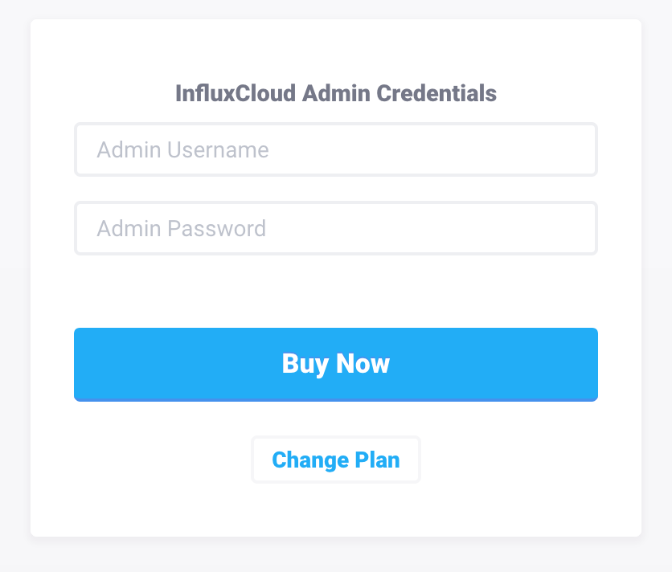
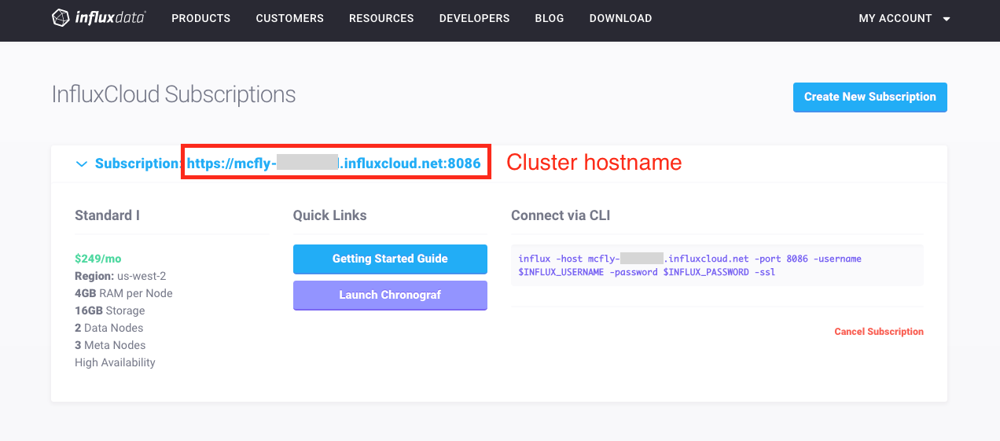

---

copyright:

  years:  2017

lastupdated: "2017-08-16"

---

{:new_window: target="_blank"}
{:shortdesc: .shortdesc}
{:screen:.screen}
{:codeblock:.codeblock}
{:pre: .pre}

# Getting started with InfluxCloud on Bluemix
{: #gettingstarted_InfluxCloud}

The [InfluxCloud](https://cloud.influxdata.com/) on Bluemix is a cloud service for storing metric, event, and time-series data using the [InfluxData platform](https://www.influxdata.com/).
An InfluxCloud cluster provides an [InfluxDB Enterprise](https://www.influxdata.com/influxenterprise/) cluster for time series storage, a [Kapacitor](https://www.influxdata.com/time-series-platform/kapacitor/) node to create alerts, and [Chronograf](https://www.influxdata.com/time-series-platform/chronograf/) to create dashboards.
InfluxCloud exposes the [InfluxDB](http://docs.influxdata.com/influxdb/v1.3/guides/writing_data/) and [Kapacitor](http://docs.influxdata.com/kapacitor/v1.3/api/api/) HTTP APIs.
{:shortdesc}

To get up and running quickly on InfluxCloud service, follow these steps:

1. Sign into [InfluxCloud](https://cloud.influxdata.com/){: new_window} or [register for a free trial](https://cloud.influxdata.com/trial/user){: new_window}.

	

2. Record the admin credentials during the InfluxCloud cluster creation flow, these will be used later for the "Username" and "Password" fields in the Bluemix InfluxCloud service creation page.

	

3. Once the cluster creation flow is complete, the newly provisioned cluster will spin up and be displayed on the dashboard after a few minutes. You'll want to record the hostname of your newly created cluster.

	

4. Add the credentials and hostname of the InfluxCloud cluster to a new Bluemix service.

	

5. Follow the [InfluxCloud Getting Started guide](https://help.influxcloud.net/getting_started/) to learn more about how to integrate your Bluemix applications with InfluxCloud.

## About

The InfluxData platform includes
- [Telegraf](https://www.influxdata.com/time-series-platform/telegraf/), a collection agent with plug-ins to easily gather metrics from 80+ services
- [InfluxDB](https://www.influxdata.com/time-series-platform/influxdb/), a high-performance database for metrics and analytics
- [Chronograf](https://www.influxdata.com/time-series-platform/chronograf/), a visual user interface for graphing InfluxDB data and creating Kapacitor alerts
- [Kapacitor](https://www.influxdata.com/time-series-platform/kapacitor/), a metrics and event processing and alerting engine
