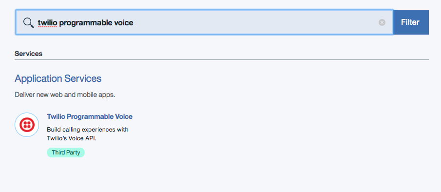
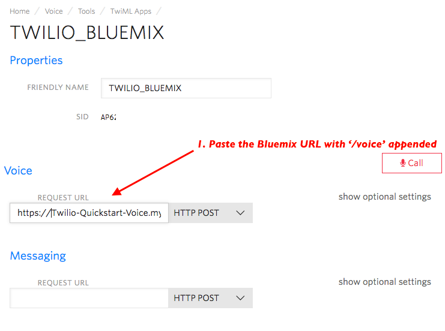

---

copyright:

  years:  2017

lastupdated: "2017-09-20"

---

{:new_window: target="_blank"}
{:shortdesc: .shortdesc}
{:screen:.screen}
{:codeblock:.codeblock}
{:pre: .pre}

# Getting started with Twilio Programmable Voice
{: #gettingstarted_TwilioProgrammableVoice}

Twilio’s [Programmable Voice](https://www.twilio.com/voice){: new_window}
makes it incredibly easy to add Voice capabilities to your mobile or web
application. Add easy ingoing and outgoing calling with monitoring and logging
capabilities in no time flat with the power of Twilio’s Cloud Voice
capabilities. It’s only a few steps from our communications APIs to a contact
center, unique support capabilities, browser dialing, or any other application
you can dream.
{: shortdesc}

## About

Without spinning up our own server, today we’re going to build a version of
[Twilio’s Node.js Browser Dialer](https://www.twilio.com/docs/tutorials/browser-dialer-node-react)
sample application. You’ll need to own (or purchase) a Voice capable phone
number, and you will need access to a WebRTC capable web browser.

## Let's get started!

1. Sign into the [Twilio Console](https://www.twilio.com/console){: new_window}
   or [Register](https://www.twilio.com/try-twilio){: new_window} for a Free
   Account

1. If necessary, download and install the [Bluemix Command Line
   Interface](https://console.bluemix.net/docs/starters/install_cli.html){: new_window}
   - Change the API Endpoint and Login:

     ```
     bluemix api https://api.ng.bluemix.net
     bluemix login
     ```
     {: codeblock}

1. Log into Bluemix Console and create a Twilio Programmable Voice Service

   - Click 'Catalog' at the top of the screen
   - Enter 'twilio programmable voice'

   

1. In the following screen, enter your `Account SID` and `Auth Token` from the
   [Twilio Console](https://www.twilio.com/console){: new_window}.

   

   Copy them to the integration.
1. Navigate to the [TwiML App section](https://www.twilio.com/console/voice/dev-tools/twiml-apps){: new_window}
   of the Twilio Console and *Create* a new TwiML App.  Name it ‘Bluemix_App’
   or similar.  Copy and paste the App SID into the service.

1. In the [Phone Numbers](https://www.twilio.com/console/phone-numbers/incoming){: new_window}
   section of the Twilio Console, either purchase or choose an existing voice
   capable Phone number. Copy and paste the phone number in
   [E.164](https://support.twilio.com/hc/en-us/articles/223183008-Formatting-International-Phone-Numbers){: new_window}
   format into the service.

   Once complete (and correct), 'Create' the Service.

1. In the Bluemix Console, select 'Catalog' -> 'Apps' -> 'Cloud Foundry Apps'
   then select the `SDK for Node.js`. Name your App something memorable.

1. With the URL of the newly created App, copy and paste the URL with `/voice` 
   appended into the 'Voice Request URL' back in the TwiML app you made above.

   If you closed it, you can get back to the
   [TwiML App here](https://www.twilio.com/console/voice/dev-tools/twiml-apps){: new_window}

   

1. In the Bluemix Dashboard, click on your Twilio Programmable Voice Service under 'Services',
   then click the 'Create connection +' button. Connect it to your new Node.js
   App.

1. Locally, clone our sample application:

    ```bash
    git clone -b bluemix-quickstart https://github.com/TwilioDevEd/browser-dialer-react
    ```

1. Deploy the application using the command line tools:

   ```bash
   bluemix app push <Your App Name>
   ```

1. In a browser which supports WebRTC, visit `<your Bluemix URL>`.  Enter your
   cell phone number (or any voice capable phone or phone number) in the
   ensuing dialog box and dial...

1. Enjoy a conversation with yourself!

And would you look (listen) at that? You’re dialing a device from the comfort
of your browser, all in under ten minutes! You’ve now got the infrastructure
you need to build a support application or your own custom browser dialing logic.

Want to go even further with Twilio? You can find all of our [Node.js
communications application tutorials](https://www.twilio.com/docs/tutorials?filter-language=node&order_by=-popularity_rank)
on our [Documentation site](https://www.twilio.com/docs/).


We can’t wait to see - and hear - what you build!
