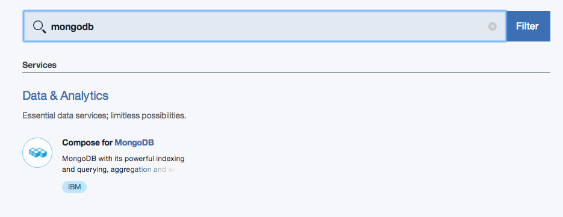
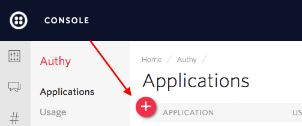

---

copyright:

  years:  2017

lastupdated: "2017-07-27"

---

{:new_window: target="_blank"}
{:shortdesc: .shortdesc}
{:screen:.screen}
{:codeblock:.codeblock}
{:pre: .pre}

# Getting started with Twilio Two-Factor Authentication and Bluemix
{: #gettingstarted_TwilioTwo-FactorAuthentication}

[Twilio’s Two Factor Authentication](https://www.twilio.com/two-factor-authentication){: new_window}
lets you easily build an additional measure of security into your login or
verification process.  Using Twilio’s Authy Authenticator App on your mobile
device, you can increase your confidence in the user logging in and help your
users protect their accounts with easy-to-implement Two Factor Authentication.
{: shortdesc}

## About

Today we’re going to build a sample Two Factor Authentication app... the
serverless way... with IBM’s Bluemix, and IBM’s Compose for MongoDB on the
backend. This example is based on our
[Authy Two-Factor Quickstart application](https://github.com/TwilioDevEd/authy2fa-node){: new_window}.

## Setting the project

Follow this steps to get started with Twilio Two-Factor Authentication on
Bluemix:

1. Using your phone platform’s Application Store download the Authy
   Two-Factor application.
   - Exact steps are platform dependent, but you should link your phone number
     to the Authy app. Our web app will eventually use this to authenticate.

2. Register your phone with Authy.

3. If necessary, download and install the
   [Bluemix Command Line Interface](https://console.bluemix.net/docs/starters/install_cli.html){: new_window}
   - Change the API Endpoint and Login:

     ```
     bluemix api https://api.ng.bluemix.net
     bluemix login
     ```
     {: codeblock}

4. Create a new Bluemix App, naming it 'Twilio-Two-Factor' or similar (this
   name will be taken, so choose something memorable)

5. While logged into the Bluemix Console, create a new Compose for MongoDB App.
   - Click 'Catalog' at the top of the screen
   - Enter 'mongodb'

     

6. Name the app as you wish, and wait for it to be created.

7. When it is finished, click the new Mongo service and 'Create connection +'.
   Connect it to the Authy Two-Factor App.

8. In the Twilio Console’s
   [Authy Applications Dashboard](https://www.twilio.com/console/authy/applications){: new_window},
   click the '+ New Application' Button:

   

   Name it something like “Bluemix Two Factor”

9. In the 'Settings' section (found on the left sidebar) click the "Eye" icon
   to reveal your Production API Key.

   

10. Back in the 'Catalog', add a new Twilio Two-Factor Authentication App.
    - Enter 'Twilio Two-Factor' and you should see the integration.
    - Click it to start entering values

    


11. Enter five environment variables:
  ```
  Twilio Account SID
  Twilio Auth Token
  Twilio Phone Number
  Application API Key
  Application Secret
  ```
  {: pre}
    - Your Account SID and Token are found in the [Twilio Console](https://www.twilio.com/console/){: new_window}
    - Grab a SMS capable phone number from your [Phone Number](https://www.twilio.com/console/phone-numbers/incoming) inventory
    - Paste in the Authy API Key from the above steps
    - Enter any secret key to hash user cookies

12. Clone our branch of the Two Factor Quickstart repository for Node:

    ```
    git clone -b bluemix-quickstart https://github.com/TwilioDevEd/authy2fa-node.git
    ```
    {: pre}

13. Run `npm install` locally.

14. Push the application to Bluemix:

    ```
    Bluemix app push <Your Twilio Authy App Name>
    ```
    {: pre}

13. Back in the Bluemix Console, 'Visit' the site that is now running!

    

14. 'Register' for a new account with your phone number (the one now connected
    to the Authy app).  Log out as soon as you’ve registered.

15. Before you log back in, copy the URL to the App (the same as the 'Visit'
    link, e.g. `https://twilio-quickstart-authy-2fa.mybluemix.net` or similar.)

16. In the back in the Twilio Console on your Authy Application Dashboard,
    navigate to 'Settings' and paste the URL with `/authy/callback` appended
    into the Webhook field.  Save it now.  The ‘Webhooks’ field will look
    something like this:

    

17. Drumroll please - back on the site, "Login" to the account you made 3 steps
    above. Depending on your phone setup, you'll now receive a SMS or a Onetouch
    Two Factor option - `Accept` it and celebrate!

And with that, you’ve successfully built out a serverless Two Factor
Authentication application with Twilio and Node! Your app’s users will now have
an additional layer of protection while logging into your site, with native Authy
applications for their phones.

But wait, there’s more - you can find all of our
[Node.js communications application tutorials](https://www.twilio.com/docs/tutorials?order_by=-popularity_rank&filter-language=node){: new_window}
on our [Documentation site](https://www.twilio.com/docs/){: new_window}. We’ve got sample
applications and ideas on how to extend your application using our security
and communications services and products.

Where you go from here is up to you - we can’t wait to see what you build!
