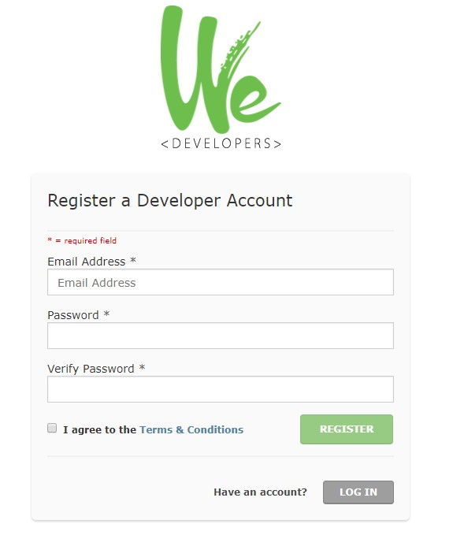
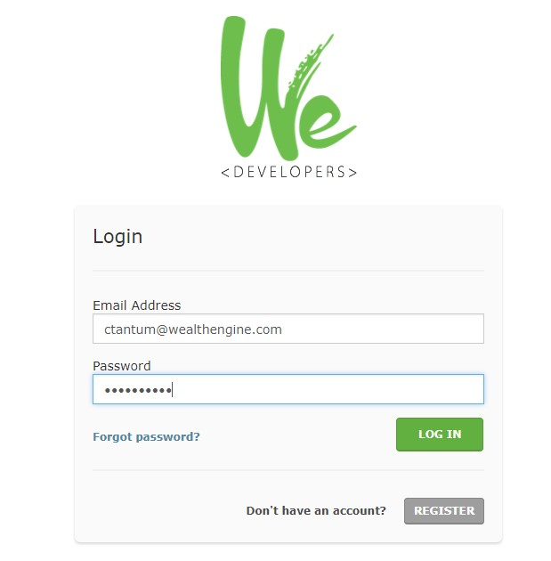
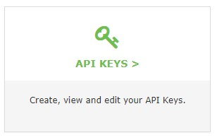

---

copyright:

  years:  2017

lastupdated: "2017-09-11"

---

{:new_window: target="_blank"}
{:shortdesc: .shortdesc}
{:screen:.screen}
{:codeblock:.codeblock}
{:pre: .pre}

<!-- This template is for getting started with a Bluemix service. It is a task template intended to document productive use of the service. It is not intended for discovery and conceptual information.  -->

<!-- The name of this file should remain index.md.
Please delete out content examples and coding that you are not using for your service. -->

# Getting started with the WealthEngine API
{: #gettingstarted_WealthEngineAPI}

<!-- Short description: REQUIRED
The WealthEngine API, available in the IBM Bluemix catalog, lets you look up the net worth and financial capacity of almost anyone in the U.S. in real time giving insight into the wallet share of clients and prospects. Simple to use, it's a restful API that returns JSON.

{:shortdesc}

<!-- If overview content is required, do not include it here. Put it in a separate "## About" section below the task section. -->

<!-- Task section: REQUIRED
The task section includes steps to integrate the service into the app.  
- With task-based, technical information, reduce the conversational style in favor of succinct and direct instructions.
- DO include the basic, most-common-use scenario steps to use the service or integrate it into the app. 
- DO NOT include steps to add the service from the Bluemix catalog; we assume that the user already took steps in the UI to add the service. 
- DO include code snippets in all languages that can be copied, as well as VCAP service info.  
- For additional tasks like configuring, managing, etc., add a task section (## Gerund_task_title) below the task section or "About" section if used. Use a task title such as "Configuring x", "Administering y", "Managing z". -->

<!-- You can include an optional prerequisites paragraph for any prerequisites to be met before integrating the service. For example: -->

<!-- Include a sentence to briefly introduce the steps. Examples: -->

To get up and running quickly with the WealthEngine API, follow these steps:

<!-- Use ordered list markup for the step section. For code examples: 
- use three backticks ahead of and after the example (```)
- For copyable code snippet, multi-line, include {: codeblock} following the last set of backticks. A copy button will display in framework in output.
- For copyable command, single line, include {: pre} following the last set of backticks. When displayed, it will show "$" at the beginning of the command example and a copy button, but the copy button will include just the command example.
- For non-copyable output snippet, include {: screen} following the last set of backticks.
 -->

1. Register for a developer account on our [developer site.](https://dev.wealthengine.com/app/#/register?utm_source=partner&utm_medium=web&utm_campaign=ibmbluemix)
	
	
	
2. Check your inbox for a link to verify your email address.
	
3. Once verified, following the prompts to use your new email and password to login. 

	

4. To get sandbox access for testing purposes, click on API Keys. 
	
	
	
5. Click on New API Key to generate a new sandbox API key for your use. 

	
	
6. Give your API key a name and click OK. 

	
	
<!-- Related links section: still REQUIRED but moved to toc file (in your same folder).  Edit there.
-->

