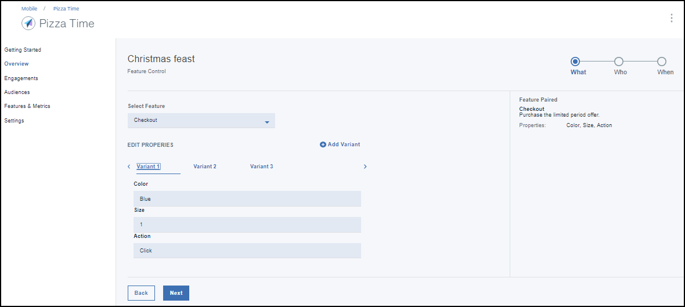

---

copyright:
 years: 2017

---

{:new_window: target="_blank"}
{:shortdesc: .shortdesc}
{:screen:.screen}
{:codeblock:.codeblock}

# Creating an engagement using Feature Control
{: #feature_control}
Last updated: 05 October 2017
{: .last-updated}

You can create an engagement using Feature Control. 

Ensure that you have gone through and have the necessary [prerequisites](app_prerequisites.html) in place.

The following image gives you an overview of the steps that needs to be completed for creating a feature.
	

Complete the following steps to create an engagement using the Feature Control:

1. You can create an engagement using either of the following methods:
	- Click **Engagements** in the navigation pane. 
	- Select **Create Engagements** on the new Feature that you have created.
	
2. The New Engagement window appears.
 
	
3. Provide a name and description to your new engagement. Ensure that you give a unique engagement name, and not one that is already listed in Engagements.
	
	To do a controlled experiment with multiple variants of the feature, select **A/B testing** on the Experimentation Mode.

4. Click **Next**.
5. Choose the Feature that you have created. You can also choose to add and define the variants that you might want to experiment with.
	

5. Click **Next**.
6. Select an audience. 
	

5. Click **Next**.
6. Define a trigger by choosing Time and the start date and an end date.
	
7. Click **Create**.
8. The new engagement now appears in the Engagement Details window.
	

You can now measure the [performance](app_measure_performance.html) of your engagement.

